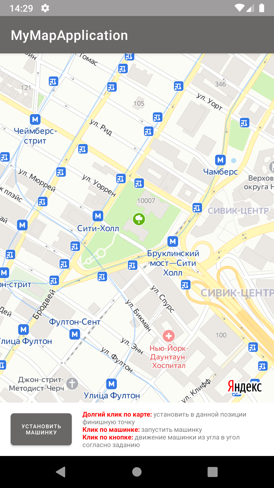
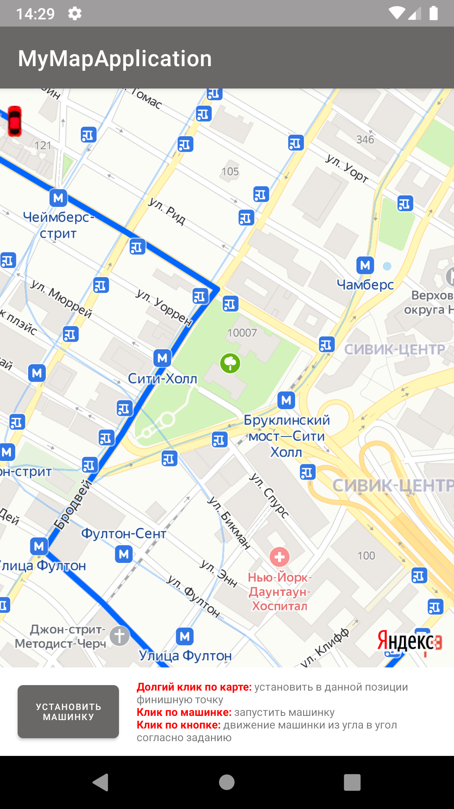
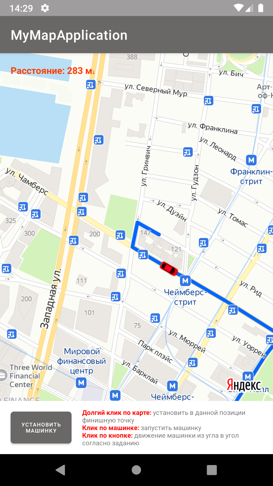
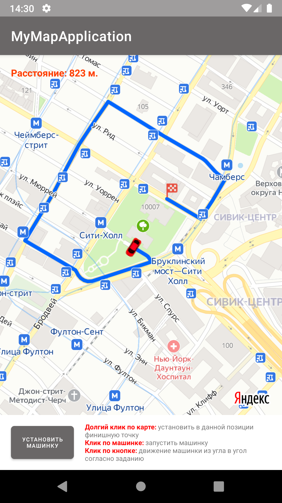
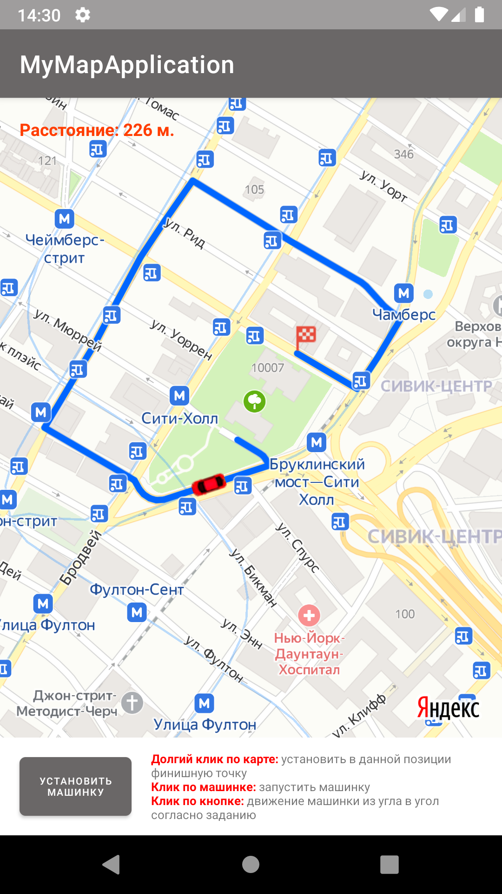
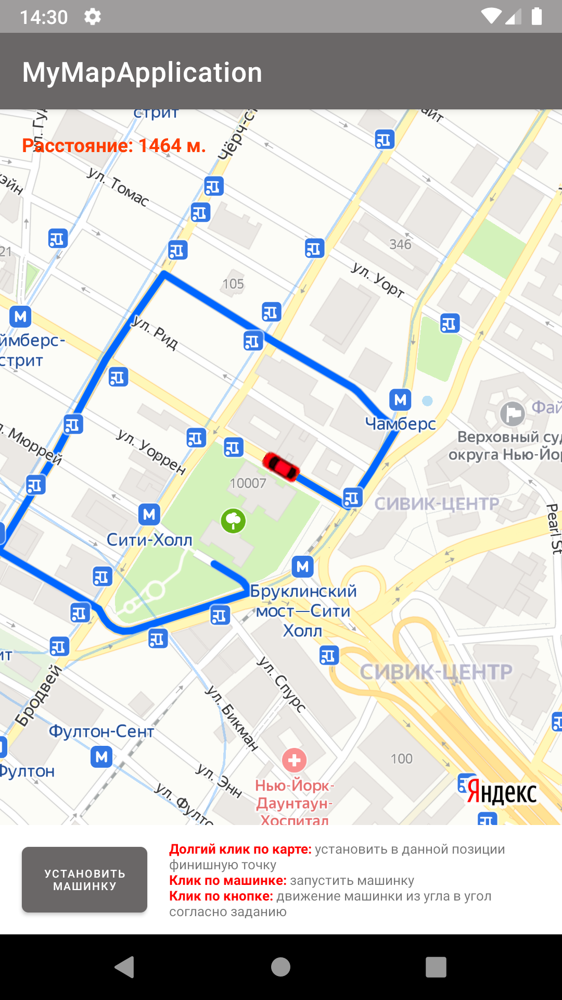

# Факультет: Android-разработки Курс: Подготовка к собеседованию Android-разработчика

### Домашние задания:
---
### Домашнее задание №3
- Напишите приложение, которое:
* Отображает макет машины как в приложении Я.Гоу или СитиМобил;
* По тапу на машину она едет по не прямой траектории из одного угла в другой.
Выбор архитектуры и библиотек остается за вами, но желательно использовать SOLID, Clean, MVVM или MVP, MVI. Будет плюсом DI (Koin, Dagger, Toothpick). Наличие тестов будет плюсом.

---

<video src="https://user-images.githubusercontent.com/19964097/155888765-23c98928-3ab4-42b9-b3e4-e2e748778dda.mp4"></video>

